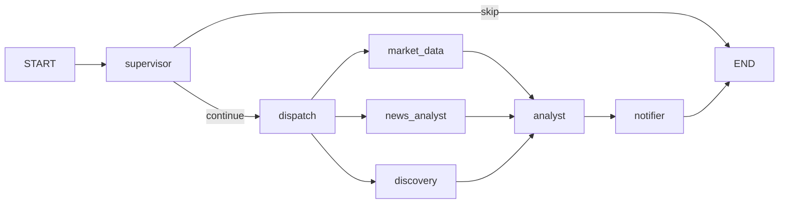
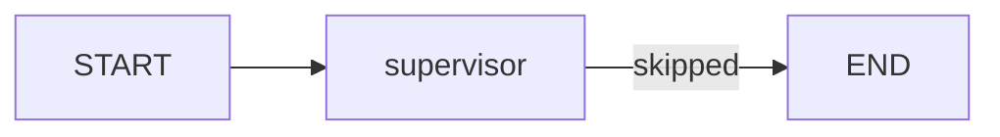
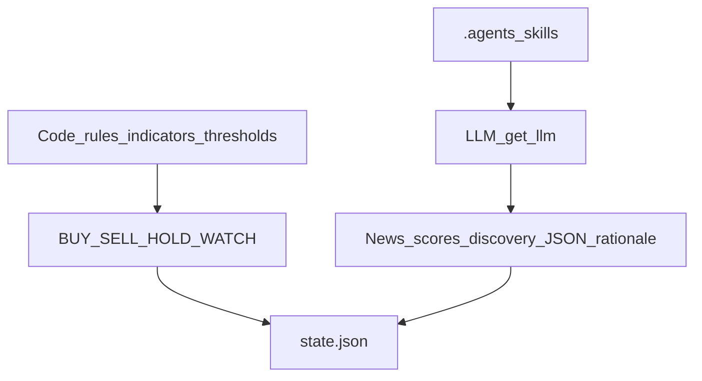
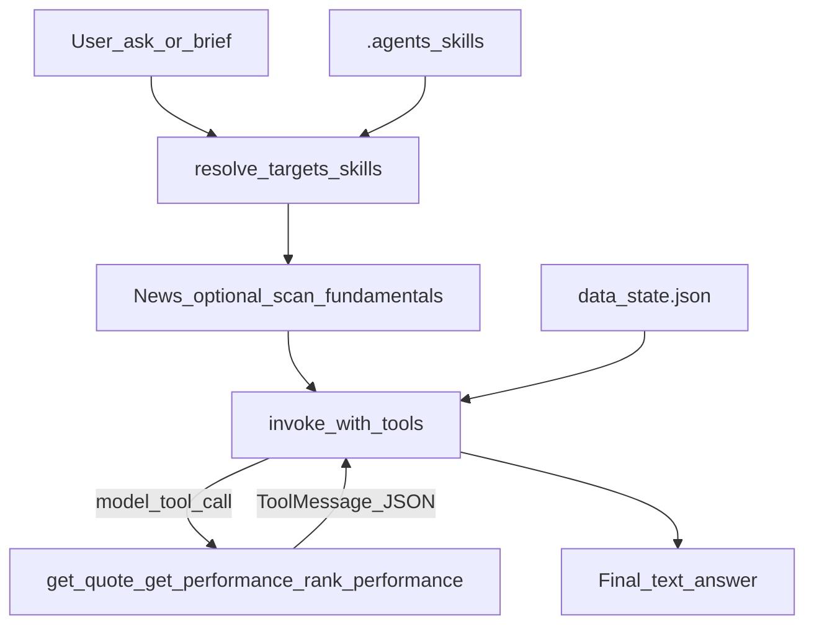
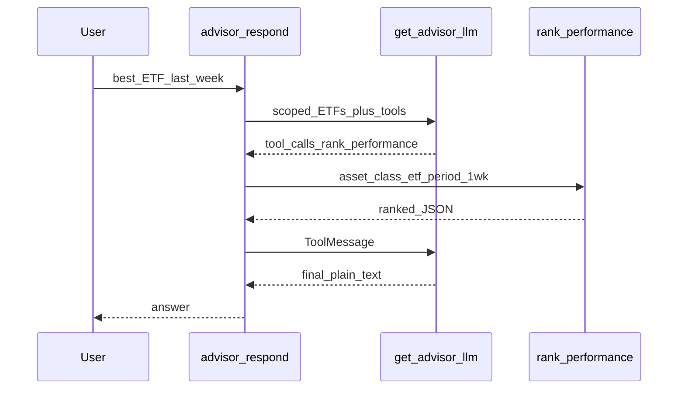

# Agent architecture

PIA is an **advisory-only** assistant. It never executes trades and has no access to the user’s portfolio. It reasons over a configured watchlist and public market data.

This document explains the LangGraph **Monitor** pipeline and the separate **Advisor** path. For the full product spec, see [`SPEC.md`](../SPEC.md).

## Two modes, one shared state

| Mode | Trigger | LLM role | Purpose |
|------|---------|----------|---------|
| **Monitor** | Schedule / Refresh / `pia-run` | Fast structured calls (`get_llm()`, reasoning off on Ollama); **no** `@tool` | Detect changes, score news, emit alerts |
| **Advisor** | Web / Telegram / CLI on demand | Deliberative (`get_advisor_llm()`) + optional **tool calls** (`get_quote`, `get_performance`, `rank_performance`) | Interpret signals, answer questions, daily brief |

```mermaid
flowchart TB
  subgraph monitorMode [Monitor]
    sched[Scheduler_or_pia_run]
    graph[LangGraph_pipeline]
    sched --> graph
    graph --> stateFile[data_state.json]
  end
  subgraph advisorMode [Advisor]
    ui[Web_Telegram_CLI]
    advisor[advisor_respond]
    tools[advisor_tools]
    ui --> advisor
    stateFile --> advisor
    advisor -->|"bind_tools"| tools
  end
  skills[.agents_skills]
  skills --> graph
  skills --> advisor
```

Both modes share:

- Watchlists: [`watchlists/stock.yaml`](../watchlists/stock.yaml), [`etf.yaml`](../watchlists/etf.yaml), [`etc.yaml`](../watchlists/etc.yaml) (defaults; Compose mounts read-only)
- Optional UI overrides: `data/watchlists_override.json` on the data volume — merged in [`src/config.py`](../src/config.py) `load_watchlists()` via [`src/watchlist_overlay.py`](../src/watchlist_overlay.py); edited from Web **Settings**
- Persisted Monitor output: `data/state.json` ([`src/state_persistence.py`](../src/state_persistence.py))
- LLM factory: [`src/llm.py`](../src/llm.py) (`ollama` | `anthropic` | `openai` / `vllm`)

## Monitor LangGraph

Defined in [`src/graph.py`](../src/graph.py). One **class-aware** pipeline tags every signal with `asset_class` (`stock` | `etf` | `etc`). There are not three separate graphs.

### Flow (markets open)



### Flow (all watchlist exchanges closed)



The supervisor uses the market calendar ([`src/tools/market_calendar.py`](../src/tools/market_calendar.py)). When `skipped` is set, workers do not run. **Manual** runs (`run_type=manual`, including dashboard Refresh) bypass the calendar so operators can refresh last available data on weekends/holidays. Skipped *scheduled* runs preserve prior signals in `state.json` instead of wiping them.

### Parallel fan-out

After `dispatch`, LangGraph `Send` runs three workers in parallel, then joins at `analyst`:

| Node | Module | Responsibility |
|------|--------|----------------|
| `supervisor` | [`src/nodes/supervisor.py`](../src/nodes/supervisor.py) | Load watchlist, decide skip vs continue, seed state |
| `dispatch` | [`src/graph.py`](../src/graph.py) | Pass-through; fan-out edge |
| `market_data` | [`src/nodes/market_data.py`](../src/nodes/market_data.py) | OHLCV + indicators (RSI, MACD, EMA, Bollinger) per ticker |
| `news_analyst` | [`src/nodes/news_analyst.py`](../src/nodes/news_analyst.py) | RSS / Google News; batched LLM sentiment scoring (+ lean skills) |
| `discovery` | [`src/nodes/discovery.py`](../src/nodes/discovery.py) | Suggest related tickers in the same asset class when possible (+ class skill) |
| `analyst` | [`src/nodes/analyst.py`](../src/nodes/analyst.py) | Rule-based signals + optional LLM rationale polish (+ class/technical/news skills); `asset_class` on each signal |
| `notifier` | [`src/nodes/notifier.py`](../src/nodes/notifier.py) | Telegram/email; lines grouped by Stocks / ETFs / ETCs |

Graph nodes are wrapped with OpenTelemetry spans `pia.graph.<name>` when telemetry is enabled.

## Rules vs LLM (Monitor)

Keep deterministic logic in code. In Monitor mode the LLM handles **classification and language only** — not chain-of-thought trading decisions. Lean Agent Skills are injected so wording and class policy stay aligned with Advisor (signals still come from rules).



- Monitor uses `get_llm()` — Ollama knobs `reasoning=False`, smaller `num_ctx` / `num_predict`.
- Never enable Advisor-style reasoning inside Monitor nodes.
- Skill selection: `select_monitor_skills()` in [`src/skills/`](../src/skills/) — class skills for the tickers in scope; technicals + news for analyst polish; news for sentiment scoring; class only for discovery.

## Asset classes

- Entries carry `asset_class` from the file they were loaded from ([`src/config.py`](../src/config.py) `load_watchlists()`).
- Fundamentals / P/E-style metrics are stock-oriented; ETF/ETC paths soften or skip valuation where N/A.
- News queries are biased by class (company name vs ETF vs commodity wording).
- Dashboard, console, and notifications present **sections per class**.

## Advisor path (not in the Monitor LangGraph)

Advisor does **not** run inside the Monitor graph. It reads the latest `state.json`, may fetch headlines / optional fundamentals / indicator scans in Python, then calls `get_advisor_llm()` in a **tool-calling loop** so the model can request live data.

Monitor still does **not** use LangChain `@tool` — its helpers under `src/tools/` are plain Python functions invoked by graph nodes.



| Surface | Entry |
|---------|--------|
| Core | [`src/nodes/advisor.py`](../src/nodes/advisor.py) `advisor_respond()` |
| Tool loop | [`src/advisor_tool_loop.py`](../src/advisor_tool_loop.py) `invoke_with_tools()` |
| Web | [`src/web/advisor_service.py`](../src/web/advisor_service.py) SSE — logs on **`pia-web`** |
| Telegram | [`src/main.py`](../src/main.py) + [`src/bot/telegram_handlers.py`](../src/bot/telegram_handlers.py) — logs on **`pia-bot`** |
| CLI | `uv run pia-advisor` |

### Tools the Advisor model can call

When `ADVISOR_FETCH_QUOTES=true` (default), Advisor binds LangChain tools via `llm.bind_tools(...)` and runs until the model returns a final text message (or max rounds). The same path works for **Ollama** (tool-capable models), **Anthropic**, and **OpenAI** / OpenAI-compatible (`vllm`) through [`src/llm.py`](../src/llm.py).

| Tool | Definition | When the model should call it | Returns |
|------|------------|-------------------------------|---------|
| `get_quote` | [`src/tools/quote_tool.py`](../src/tools/quote_tool.py) `@tool` | Needs live price, daily change %, volume, or currency for a ticker | JSON string (`ticker`, `price`, `change_pct`, `volume`, `currency`, `as_of`) |
| `get_performance` | [`src/tools/performance_tool.py`](../src/tools/performance_tool.py) `@tool` | Single-ticker period return (`1wk` / `1mo` / `3mo` / `ytd` / `1y`) | JSON (`return_pct`, start/end prices & dates, or `error`) |
| `rank_performance` | same module `@tool` | Best/worst across watchlist or an asset class | JSON (`ranked` by `return_pct` desc, `errors`) |

Live quotes and period returns are **not** pre-fetched into the prompt when tools are enabled — the model must call them. Look for log lines `Advisor tool round N: get_quote` / `get_performance` / `rank_performance`.

**Asset-class hard scope (Advisor `/ask`):** when the question clearly names ETFs, stocks, or ETCs, watchlist + Monitor signals in the prompt are filtered to that class only (so a stock like `MU` cannot be cited as an ETF). Skills activate for the scoped class. Conversation history that mentions out-of-scope tickers is stripped when a class scope is active.

**Period performance:** when `ADVISOR_FETCH_QUOTES=true` (tools enabled), period/ranking asks go through the LLM with instructions to call `rank_performance` / `get_performance`. When tools are disabled, Advisor returns a **deterministic refusal** instead of inventing returns. See [`plans/get_performance_tool.md`](plans/get_performance_tool.md).



Set `ADVISOR_FETCH_QUOTES=false` to disable Advisor tools (no live quotes or period returns). If `bind_tools` fails for a given backend, Advisor falls back to a plain invoke without tools.

### Skills

Runtime Agent Skills ([agentskills.io](https://agentskills.io/specification)) live under [`.agents/skills/`](../.agents/skills/). Loader: [`src/skills/`](../src/skills/).

| Path | Activation |
|------|------------|
| **Advisor** | `select_skills()` by asset class and question intent |
| **Monitor** | `select_monitor_skills()` — lean subset for news / discovery / analyst polish LLM calls |

Shared catalog: `stock-analysis`, `etf-analysis`, `etc-analysis`, `market-technicals`, `news-sentiment`.

### Daily brief structure

`/brief` prompts the model for compact plain-text labels (not markdown headings):

1. `STOCKS`
2. `ETFS`
3. `ETCS` (omit if watchlist empty)
4. `THEMES` (short cross-class bullets, or `None.`)

Context is grouped by `asset_class` before the LLM call so classes are not mixed into one soup.

## Scheduling surfaces

Who runs Monitor on the clock depends on the environment:

| Environment | Mechanism | `PIA_MONITOR_SCHEDULER` |
|-------------|-----------|-------------------------|
| Local `uv run pia-web` / default Compose | APScheduler in [`src/monitor_scheduler.py`](../src/monitor_scheduler.py) | `true` (default) |
| Compose Ofelia profile | External cron containers | `false` — see [compose.md](compose.md) |
| Kubernetes / OpenShift | CronJobs `pia-run-*` | `false` on Deployments — see [kubernetes.md](kubernetes.md), [openshift.md](openshift.md) |

Dashboard **Refresh Monitor** (`POST /api/monitor/run`) always triggers one manual run under a process-wide lock (does not replace the schedule).

## LLM providers (summary)

Default: **Ollama on the host** (`PIA_LLM_PROVIDER=ollama`).

| Provider | Typical env |
|----------|-------------|
| Ollama | `OLLAMA_BASE_URL`, `OLLAMA_MODEL` |
| vLLM / OpenAI-compatible | `PIA_LLM_PROVIDER=vllm`, `OPENAI_BASE_URL` or `LLM_BASE_URL`, `OPENAI_MODEL` or `VLLM_MODEL` |
| Anthropic | `PIA_LLM_PROVIDER=anthropic`, `ANTHROPIC_API_KEY` |
| Split | `PIA_LLM_MONITOR_PROVIDER` / `PIA_LLM_ADVISOR_PROVIDER` |

Factory details: [`src/llm.py`](../src/llm.py). Deploy-specific URLs: [compose.md](compose.md), [kubernetes.md](kubernetes.md), [openshift.md](openshift.md).

## Telemetry

Optional OTLP GenAI traces (`PIA_OTEL_ENABLED`). Spans include `pia.graph.*`, `gen_ai.chat.*`, `pia.advisor.*`, `pia.skills.activated`. Local Aspire Dashboard: [`deploy/otel/README.md`](../deploy/otel/README.md).

## Related entry points

| Command | Role |
|---------|------|
| `uv run pia-web` | Web UI + optional in-process scheduler |
| `uv run pia-bot` | Telegram + optional in-process scheduler |
| `uv run pia-run --run-type …` | One-shot Monitor (timers / CronJobs / Ofelia) |
| `uv run pia-graph` | Dev Monitor run with Rich console |
| `uv run pia-console` | Read-only terminal dashboard of `state.json` |
