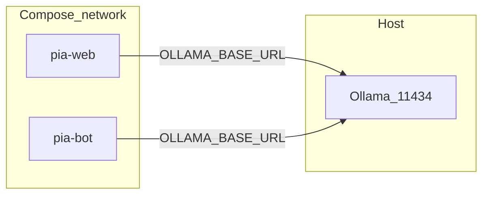
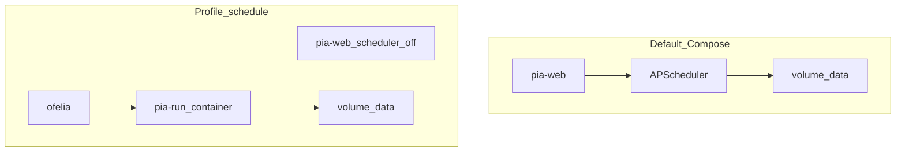

# Deploy with Docker / Podman Compose

**Home packaging** for PIA (Phase **5a**). Short pointer: [`docker/README.md`](../docker/README.md). Helper: [`docker/up.sh`](../docker/up.sh).

Architecture context: [agent_architecture.md](agent_architecture.md). For Kubernetes / OpenShift see [kubernetes.md](kubernetes.md) and [openshift.md](openshift.md).

## Prerequisites

You need **all** of the following for the default home stack:

| Requirement | Details |
|-------------|---------|
| **Podman** *or* **Docker** | Container runtime (`podman --version` or `docker --version`) |
| **Compose provider** | One of: `podman-compose`, `podman compose`, `docker compose` (v2 plugin), or `docker-compose` |
| **Ollama on the host** | Default LLM — install from [ollama.com](https://ollama.com); keep the daemon running on host port `11434`. Ollama is **not** started by Compose. |
| Repo checkout | Includes `watchlists/` and `.agents/skills/` |

Optional:

- Telegram (`TELEGRAM_*` in `.env`) for Advisor bot
- NVIDIA GPU + Compose `--profile gpu` for in-stack vLLM (instead of host Ollama)
- Stub profile for smoke tests without Ollama

```bash
cd /path/to/personal-investment-assistant
cp .env.example .env   # edit secrets / OLLAMA_BASE_URL (see Host Ollama below)
```

One-shot helper (builds image + default `up`):

```bash
./docker/up.sh
```

## Build images

```bash
podman build -t localhost/pia:local -f docker/Dockerfile .
# Only needed for --profile stub:
podman build -t localhost/pia-llm-stub:local -f docker/llm-stub/Dockerfile docker/llm-stub
```

- [`docker/Dockerfile`](../docker/Dockerfile) — CPU PIA image (non-root user `pia`, uid 1000)
- [`docker/llm-stub/`](../docker/llm-stub/) — tiny OpenAI-compatible stub for smoke tests (no GPU)

## Compose files

| File | Role |
|------|------|
| [`docker/compose.yml`](../docker/compose.yml) | Base stack: `pia-web`, `pia-bot`, one-shot `pia-run`; optional `llm-stub` / `vllm` / `ofelia` |
| [`docker/compose.stub.yml`](../docker/compose.stub.yml) | Force PIA → stub via DNS alias `vllm` (adds `depends_on: llm-stub`) |
| [`docker/compose.gpu.yml`](../docker/compose.gpu.yml) | Force PIA → real vLLM service (adds `depends_on: vllm`) |
| [`docker/compose.schedule.yml`](../docker/compose.schedule.yml) | Turn **off** in-process scheduler when using Ofelia |
| [`docker/ofelia.ini`](../docker/ofelia.ini) | Ofelia cron → ephemeral `pia-run` containers |

Project name is `pia` (named volumes like `pia_pia-data`).

## Profiles

| Profile / override | Purpose |
|--------------------|---------|
| (default) | `pia-web` + `pia-bot` + one-shot `pia-run` — LLM from `.env` (usually host Ollama) |
| `--profile stub` + `compose.stub.yml` | OpenAI-compatible stub (Service DNS alias `vllm`) |
| `--profile gpu` + `compose.gpu.yml` | Real [vLLM](https://docs.vllm.ai/) on NVIDIA |
| `--profile schedule` + `compose.schedule.yml` | Ofelia external cron (mutually exclusive with in-process scheduler) |

## Quick starts

### Host Ollama (default — Mac / Linux)

Ollama stays on the **host**. Containers must not use `localhost:11434` (that is the container itself).

In `.env`:

```bash
PIA_LLM_PROVIDER=ollama
OLLAMA_MODEL=qwen3:8b
# Podman:
OLLAMA_BASE_URL=http://host.containers.internal:11434
# Docker Desktop:
# OLLAMA_BASE_URL=http://host.docker.internal:11434
PIA_MONITOR_SCHEDULER=true
```

```bash
./docker/up.sh
# or: podman-compose -f docker/compose.yml up -d
```

Dashboard: http://127.0.0.1:8765



### Stub smoke (no GPU, no Ollama)

```bash
podman-compose -f docker/compose.yml -f docker/compose.stub.yml --profile stub up -d
curl -s http://127.0.0.1:8765/api/health
podman-compose -f docker/compose.yml -f docker/compose.stub.yml --profile stub run --rm pia-run --run-type manual
```

### vLLM on NVIDIA (Compose GPU profile)

```bash
export VLLM_MODEL=Qwen/Qwen3-8B   # optional
podman-compose -f docker/compose.yml -f docker/compose.gpu.yml --profile gpu up -d
```

```bash
PIA_LLM_PROVIDER=vllm
OPENAI_BASE_URL=http://vllm:8000/v1   # or LLM_BASE_URL=
OPENAI_MODEL=Qwen/Qwen3-8B            # or VLLM_MODEL=
OPENAI_API_KEY=not-needed
```

### Cloud-only (no stub / no vLLM container)

```bash
PIA_LLM_PROVIDER=anthropic   # or openai
ANTHROPIC_API_KEY=...
podman-compose -f docker/compose.yml up -d
```

Cloud mode sends watchlist tickers, signals, and headlines to the provider.

## Monitor scheduling

### Default: in-process APScheduler

With `PIA_MONITOR_SCHEDULER=true` (default on `pia-web`), Monitor runs at **08:00 / 13:00 / 17:30** in `TIMEZONE` via [`src/monitor_scheduler.py`](../src/monitor_scheduler.py). Default Compose sets `PIA_MONITOR_SCHEDULER=false` on `pia-bot` so only one process owns the schedule. `pia-run` also starts once on `up` for an immediate Monitor pass.

- Dashboard **Refresh Monitor** → `POST /api/monitor/run` (manual, locked)
- No Docker socket or Ofelia required

### Optional: Ofelia (external cron)

Use **either** Ofelia **or** in-process scheduler — not both.

```bash
# .env or compose.schedule.yml
PIA_MONITOR_SCHEDULER=false

podman-compose -f docker/compose.yml -f docker/compose.schedule.yml \
  --profile schedule up -d
```

Ofelia starts ephemeral `localhost/pia:local` containers running `pia-run --run-type …`. Requires a Docker-compatible socket (`/var/run/docker.sock`). Adjust volume names in `ofelia.ini` if your Compose project name is not `pia`.



## Volumes and mounts

| Volume / bind | Path in container |
|---------------|-------------------|
| `pia-data` | `/app/data` (`state.json`, advisor history) |
| `pia-logs` | `/app/logs` |
| `pia-cache` | `/app/.cache` |
| bind `watchlists/` | `/app/watchlists` (read-only) |
| bind `.agents/` | `/app/.agents` (read-only) |

## Web binding and auth

Containers set `PIA_WEB_HOST=0.0.0.0` and publish **8765**. If the port is reachable beyond localhost, set `PIA_WEB_TOKEN` in `.env` (API requires `X-PIA-Token` or `?token=`).

## Troubleshooting

| Symptom | Likely cause |
|---------|----------------|
| Advisor “Connection error” / “Check Ollama” | `OLLAMA_BASE_URL=http://localhost:11434` **inside** a container, or leftover `PIA_LLM_PROVIDER=vllm` pointing at a dead stub |
| Stub works but Ollama does not | Wrong host gateway (`host.containers.internal` vs `host.docker.internal`) |
| Double Monitor runs | Ofelia **and** `PIA_MONITOR_SCHEDULER=true` |
| Empty dashboard | No successful Monitor yet — Refresh Monitor or `compose run … pia-run` |
| Image pull `pia:local` denied | Use `localhost/pia:local` (Podman short-name resolution) |

## Related

- Architecture: [agent_architecture.md](agent_architecture.md)
- OTEL Aspire (separate compose): [`deploy/otel/README.md`](../deploy/otel/README.md)
- Env template: [`.env.example`](../.env.example)
