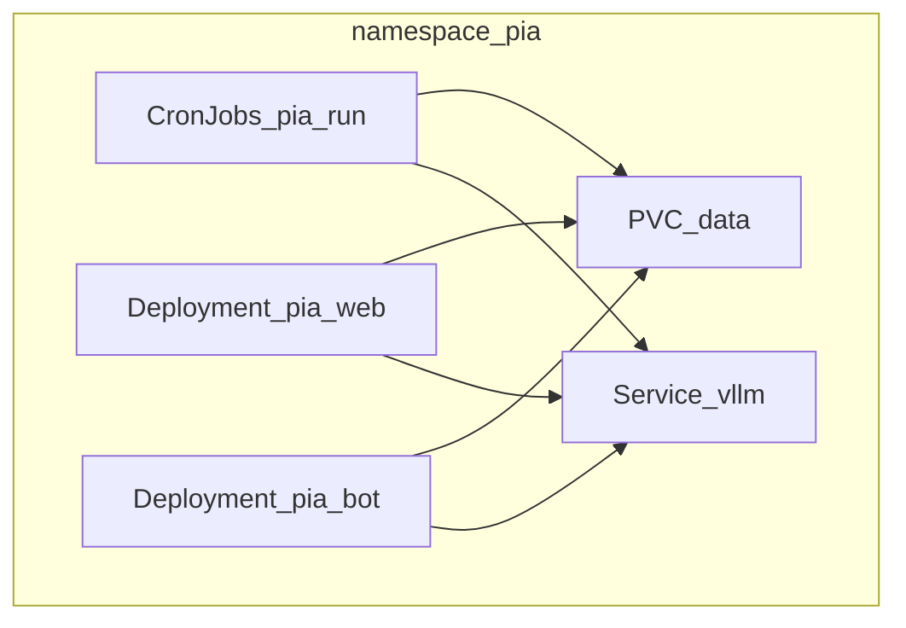

# Deploy on Kubernetes

Full operator guide for Phase **5b**. Short pointer: [`deploy/k8s/README.md`](../deploy/k8s/README.md).

Architecture: [agent_architecture.md](agent_architecture.md). Compose: [compose.md](compose.md). OpenShift: [openshift.md](openshift.md).

## Overview

Raw manifests under [`deploy/k8s/`](../deploy/k8s/) (Kustomize, no Helm in v1).



**Locked scheduling rule:** CronJobs own the Monitor clock. Long-running Deployments set `PIA_MONITOR_SCHEDULER=false` so in-process APScheduler does not double-fire. Dashboard **Refresh Monitor** still runs one manual Monitor inside the `pia-web` pod against the shared PVC.

## Layout

```
deploy/k8s/
  base/                 # namespace, PVCs, pia-web, pia-bot, CronJobs, watchlists ConfigMap
  overlays/
    stub/               # OpenAI-compatible stub as Service vllm (kind / no GPU)
    gpu/                # real vLLM Deployment (NVIDIA)
    cloud-only/         # no vLLM; Anthropic/OpenAI via Secret
  README.md
```

### Base resources (`deploy/k8s/base/`)

| Manifest | Role |
|----------|------|
| `namespace.yaml` | `pia` namespace |
| `pvc-data.yaml` | Shared `data/` + logs PVCs (also holds `watchlists_override.json` from Web Settings) |
| `configmap-watchlists.yaml` | `stock.yaml` / `etf.yaml` / `etc.yaml` (defaults; typically read-only mount) |
| `deployment-pia-web.yaml` | Web UI + ConfigMap `pia-config` (includes `PIA_MONITOR_SCHEDULER=false`) |
| `deployment-pia-bot.yaml` | Telegram bot, **replicas: 1** |
| `cronjob-pia-run.yaml` | `pre_market` / `midday` / `end_of_day` + suspended `manual` |
| `secret.example.yaml` | Template only — do not commit real secrets |
| `kustomization.yaml` | Assembles base (secrets applied separately) |

### Overlays

| Overlay | LLM backend |
|---------|-------------|
| `overlays/stub` | CPU stub image; Service name still `vllm` so DNS stays `http://vllm:8000/v1` |
| `overlays/gpu` | `vllm/vllm-openai`, `nvidia.com/gpu: 1`, HF cache PVC |
| `overlays/cloud-only` | No vLLM Deployment; provider via Secret keys |

Service DNS **`vllm:8000`** is stable across stub and GPU overlays:

```bash
PIA_LLM_PROVIDER=vllm
OPENAI_BASE_URL=http://vllm:8000/v1
LLM_BASE_URL=http://vllm:8000/v1          # alias
OPENAI_MODEL=<model-id>                   # or VLLM_MODEL=
OPENAI_API_KEY=not-needed                 # or real key if required
PIA_MONITOR_SCHEDULER=false
```

## Prerequisites

- Cluster with `kubectl` and Kustomize (`kubectl apply -k`)
- Images available to the cluster: `pia:local` (and `pia-llm-stub:local` for stub overlay)
- Secret `pia-secrets` in namespace `pia`

```bash
kubectl create namespace pia
# Edit values first, or create from literals:
kubectl -n pia create secret generic pia-secrets \
  --from-literal=OPENAI_API_KEY=not-needed \
  --from-literal=TELEGRAM_BOT_TOKEN= \
  --from-literal=TELEGRAM_CHAT_ID= \
  --from-literal=ANTHROPIC_API_KEY= \
  --from-literal=PIA_WEB_TOKEN= \
  --from-literal=HUGGING_FACE_HUB_TOKEN=
```

Template reference: [`deploy/k8s/base/secret.example.yaml`](../deploy/k8s/base/secret.example.yaml).

## Layer 2 — kind / k3d without GPU (recommended first)

Validates manifests, PVC sharing, CronJob image/command, and Service DNS — everything except CUDA/vLLM.

```bash
kind create cluster --name pia

# Build then load (Podman tags often need localhost/ prefix)
podman build -t localhost/pia:local -f docker/Dockerfile .
podman build -t localhost/pia-llm-stub:local -f docker/llm-stub/Dockerfile docker/llm-stub
kind load docker-image localhost/pia:local --name pia
kind load docker-image localhost/pia-llm-stub:local --name pia

kubectl apply -k deploy/k8s/overlays/stub

kubectl -n pia rollout status deploy/vllm
kubectl -n pia rollout status deploy/pia-web

kubectl -n pia create job --from=cronjob/pia-run-manual "pia-run-manual-$(date +%s)"
# wait for Job complete, then:
kubectl -n pia port-forward svc/pia-web 8765:8765
```

Assert:

- [ ] Job exit 0
- [ ] PVC contains `state.json`
- [ ] `GET /api/health` → ok
- [ ] Advisor ask returns stub prose
- [ ] Optional: delete `deploy/vllm` → next Job fails with LLM connection error

## Layer 3 — real GPU smoke

Requires NVIDIA device plugin and GPU nodes.

```bash
kubectl apply -k deploy/k8s/overlays/gpu
kubectl -n pia rollout status deploy/vllm --timeout=600s
# /v1/models must list the configured model

kubectl -n pia create job --from=cronjob/pia-run-manual "pia-run-gpu-$(date +%s)"
kubectl -n pia port-forward svc/pia-web 8765:8765
```

Checklist:

- [ ] vLLM Ready; `/v1/models` lists configured model
- [ ] Monitor Job succeeds; `state.json` updated
- [ ] Advisor ask returns real model text
- [ ] PIA pods request **no** `nvidia.com/gpu`
- [ ] `pia-bot` remains `replicas: 1`
- [ ] No OOM under one Monitor + one Advisor call
- [ ] Optional: `PIA_LLM_ADVISOR_PROVIDER=anthropic` with Monitor still on vLLM

## Cloud-only overlay

```bash
kubectl apply -k deploy/k8s/overlays/cloud-only
# Ensure ANTHROPIC_API_KEY or OPENAI_API_KEY in pia-secrets
```

No vLLM pod; CronJobs and Deployments still share the data PVC.

## CronJobs and manual runs

| CronJob | Schedule (cluster TZ — set explicitly if needed) | Command |
|---------|--------------------------------------------------|---------|
| `pia-run-pre-market` | `0 8 * * *` | `pia-run --run-type pre_market` |
| `pia-run-midday` | `0 13 * * *` | `pia-run --run-type midday` |
| `pia-run-end-of-day` | `30 17 * * *` | `pia-run --run-type end_of_day` |
| `pia-run-manual` | suspended | `pia-run --run-type manual` |

Trigger ad-hoc:

```bash
kubectl -n pia create job --from=cronjob/pia-run-manual "pia-run-manual-$(date +%s)"
```

## Ingress, auth, bot scaling

- Default Service type is ClusterIP. For Ingress: terminate TLS at the edge and set `PIA_WEB_TOKEN`.
- `pia-bot` **must** stay at `replicas: 1` with Telegram long polling. Migrate to webhooks before scaling.
- Prefer OpenShift Routes documented in [openshift.md](openshift.md) when on OpenShift.

## Energy / uptime

- GPU vLLM nodes are costly when idle — scale to zero or use cloud-only / RHOAI shared serving when appropriate.
- CronJobs cover Monitor; keep `pia-web` / `pia-bot` as long-running Deployments.

## Troubleshooting

| Symptom | Likely cause |
|---------|----------------|
| CronJob + unexpected second daily runs | `PIA_MONITOR_SCHEDULER` still `true` on a Deployment |
| Cannot resolve `vllm` | Wrong overlay / Service not ready |
| Empty watchlist in pod | ConfigMap mount path or empty YAML |
| Bot duplicate replies | Scaled `pia-bot` above 1 replica |

## Related

- Image build: [`docker/Dockerfile`](../docker/Dockerfile)
- Compose local path: [compose.md](compose.md)
- OpenShift AI serving: [openshift.md](openshift.md)
