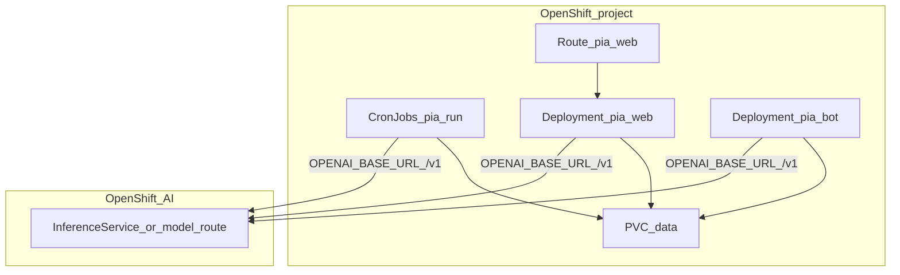

# Deploy on OpenShift with OpenShift AI

This guide covers running PIA on **Red Hat OpenShift**, using **Red Hat OpenShift AI (RHOAI)** model serving for the LLM. RHOAI commonly exposes models through a **vLLM-backed**, OpenAI-compatible HTTP API — the same client path PIA already uses (`PIA_LLM_PROVIDER=vllm`).

Manifests start from [`deploy/k8s/`](../deploy/k8s/). Adapt for Routes, the internal registry, and Security Context Constraints (SCC). Full plain-Kubernetes detail: [kubernetes.md](kubernetes.md). Architecture: [agent_architecture.md](agent_architecture.md).



## What this guide does not cover

- Installing the OpenShift AI / RHOAI **operator** from scratch (use Red Hat product docs)
- Full Data Science Project UI walkthroughs beyond obtaining a serving URL and model id
- Helm charts (PIA v1 uses Kustomize / raw YAML)

## Prerequisites

- OpenShift cluster with CLI (`oc`) and permission to create projects, Deployments, CronJobs, PVCs, Routes, Secrets
- OpenShift AI installed with **model serving** available (vLLM runtime or equivalent OpenAI-compatible endpoint)
- Ability to push images to the cluster registry (or an external registry the cluster can pull)
- PIA image built from [`docker/Dockerfile`](../docker/Dockerfile) (non-root user `pia`, uid **1000**)

## 1. Relationship to Kubernetes manifests

| Kubernetes | OpenShift adaptation |
|------------|----------------------|
| Ingress | **Route** (edge or reencrypt TLS) |
| `kubectl apply -k` | `oc apply -k` (same Kustomize trees under `deploy/k8s/`) |
| anonymous pull of `pia:local` | BuildConfig / ImageStream or `oc import-image` / push to `image-registry.openshift-image-registry.svc` |
| anyuid / root | Prefer **restricted** SCC; image already runs as uid 1000 — drop privileged requests |
| in-cluster Service `vllm` | Often replaced by a **Route or Service** to the RHOAI InferenceService |

Recommended: keep `PIA_MONITOR_SCHEDULER=false` on Deployments (same as K8s). Use CronJobs for Monitor.

## 2. Build and push the PIA image

```bash
# Example: build locally and push to OpenShift internal registry
oc project pia   # or: oc new-project pia

podman build -t image-registry.openshift-image-registry.svc:5000/pia/pia:latest \
  -f docker/Dockerfile .

# Log in to the registry (token from oc whoami -t)
podman login -u $(oc whoami) -p $(oc whoami -t) \
  image-registry.openshift-image-registry.svc:5000 --tls-verify=false

podman push image-registry.openshift-image-registry.svc:5000/pia/pia:latest
```

Update Deployment image fields (or ImageStream tags) to `image-registry.openshift-image-registry.svc:5000/pia/pia:latest` instead of `pia:local`.

Alternatively use an OpenShift **BuildConfig** from the Dockerfile in-repo.

## 3. OpenShift AI model serving (vLLM)

### Obtain the endpoint

In the OpenShift AI / Data Science UI (or `oc get inferenceservices -n <serving-ns>`):

1. Deploy or select a model served with a **vLLM** (or OpenAI-compatible) runtime.
2. Note:
   - **External or in-cluster URL** for chat completions (must include the `/v1` API root PIA expects as `OPENAI_BASE_URL`)
   - **Model id** as registered on the server (used as `OPENAI_MODEL` / `VLLM_MODEL`)
   - **Auth token** if the endpoint requires `Authorization: Bearer …` (map to `OPENAI_API_KEY`)

In-cluster example (names vary by RHOAI version):

```text
http://<inference-service>.<namespace>.svc.cluster.local:8080/v1
```

Or a Route:

```text
https://<model-route>.apps.<cluster>/v1
```

### Configure PIA

Do **not** deploy the in-tree `overlays/gpu` vLLM pod if RHOAI already serves the model. Use a **cloud-only-style** ConfigMap (no co-located `vllm` Deployment) pointing at RHOAI:

```bash
PIA_LLM_PROVIDER=vllm
OPENAI_BASE_URL=https://<inference-route>/v1   # or LLM_BASE_URL=
OPENAI_MODEL=<served-model-id>                 # or VLLM_MODEL=
OPENAI_API_KEY=<token-if-required>
PIA_MONITOR_SCHEDULER=false
PIA_WEB_HOST=0.0.0.0
```

Optional split (Monitor on RHOAI, Advisor on Anthropic):

```bash
PIA_LLM_MONITOR_PROVIDER=vllm
PIA_LLM_ADVISOR_PROVIDER=anthropic
ANTHROPIC_API_KEY=...
```

Store secrets in an OpenShift Secret (not git):

```bash
oc -n pia create secret generic pia-secrets \
  --from-literal=OPENAI_API_KEY='<token-or-not-needed>' \
  --from-literal=TELEGRAM_BOT_TOKEN='' \
  --from-literal=TELEGRAM_CHAT_ID='' \
  --from-literal=ANTHROPIC_API_KEY='' \
  --from-literal=PIA_WEB_TOKEN='<random>' \
  --dry-run=client -o yaml | oc apply -f -
```

### TLS to the inference Route

If `OPENAI_BASE_URL` is `https://…` with a cluster CA:

- Prefer mounting the OpenShift service CA / trusted bundle into the PIA container, **or**
- Use the **in-cluster Service DNS** HTTP URL for InferenceService so pods do not need public TLS.

PIA uses the LangChain OpenAI client; standard corporate TLS trust rules apply.

## 4. Deploy PIA workloads

### Apply adapted manifests

Starting point:

```bash
oc apply -k deploy/k8s/overlays/cloud-only
# then patch image names and OPENAI_BASE_URL to the RHOAI endpoint
```

Or copy `deploy/k8s/base` into a cluster-specific overlay that:

1. Sets `PIA_MONITOR_SCHEDULER=false`
2. Sets `OPENAI_BASE_URL` / `OPENAI_MODEL` to the RHOAI endpoint
3. Removes any dependency on Service `vllm` inside the `pia` namespace
4. Points container images at your ImageStream
5. Keeps CronJobs + PVC + watchlists ConfigMap

### Shared storage

- PVC for `/app/data` (and logs) shared by CronJob Jobs, `pia-web`, and `pia-bot` (same pattern as [kubernetes.md](kubernetes.md)). UI watchlist overrides are stored here as `watchlists_override.json`.
- Watchlists via ConfigMap mount at `/app/watchlists` (typically read-only defaults).

### Route for the web UI

```bash
oc -n pia create route edge pia-web --service=pia-web --port=8765
# or reencrypt / passthrough per security policy
```

Set `PIA_WEB_TOKEN` when the Route is reachable beyond the cluster. Default app binds `0.0.0.0:8765` in containers.

### Telegram bot

- Deployment `pia-bot` with **replicas: 1** (long polling).
- For HA, migrate to Telegram webhooks behind a Route before scaling.

## 5. Networking summary

| Traffic | Path |
|---------|------|
| Users → dashboard / Advisor | Route → Service `pia-web:8765` |
| PIA → LLM | Pod → RHOAI InferenceService / Route (`OPENAI_BASE_URL`) |
| CronJob → LLM | Same as above (Job pods need egress to serving namespace) |
| CronJob → state | Write `data/state.json` on shared PVC |

Ensure NetworkPolicies (if any) allow the `pia` namespace to reach the serving namespace.

## 6. Verification checklist

- [ ] `oc -n pia get pods` — `pia-web` Ready; CronJobs present
- [ ] `curl -s https://<pia-web-route>/api/health` → `{"status":"ok"}` (with token if required)
- [ ] From a debug pod: `curl -s "$OPENAI_BASE_URL/models"` lists `OPENAI_MODEL`
- [ ] `oc -n pia create job --from=cronjob/pia-run-manual "pia-run-manual-$(date +%s)"` completes
- [ ] PVC contains updated `state.json`
- [ ] Advisor **Daily brief** / ask returns text from the RHOAI model (not stub boilerplate)
- [ ] Only one Monitor schedule source (CronJobs; scheduler flag false)

## 7. Troubleshooting

| Symptom | Likely cause |
|---------|----------------|
| `APIConnectionError` to model | Wrong `OPENAI_BASE_URL`, missing `/v1`, NetworkPolicy, or TLS trust |
| 404 / model not found | `OPENAI_MODEL` / `VLLM_MODEL` ≠ served model id |
| 401 from inference | Missing or wrong `OPENAI_API_KEY` |
| Double daily Monitor runs | CronJobs **and** `PIA_MONITOR_SCHEDULER=true` |
| Permission denied writing `data/` | PVC permissions / SCC vs uid 1000 |
| Route works externally but Jobs fail | Jobs need in-cluster URL, not public Route blocked from pod egress |
| Bot flapping / duplicate messages | `pia-bot` replicas &gt; 1 |

## Optional: co-located vLLM instead of RHOAI

If you are **not** using OpenShift AI serving, you can still apply [`deploy/k8s/overlays/gpu`](../deploy/k8s/overlays/gpu) on OpenShift with GPU nodes and Machine Sets — same caveats as [kubernetes.md](kubernetes.md) Layer 3. Prefer RHOAI when the platform already provides a shared vLLM endpoint.

## Related

- Plain Kubernetes: [kubernetes.md](kubernetes.md)
- Compose (laptop): [compose.md](compose.md)
- Env template: [`.env.example`](../.env.example)
- Red Hat OpenShift AI documentation (operator install & model serving): consult current Red Hat product docs for your cluster version
